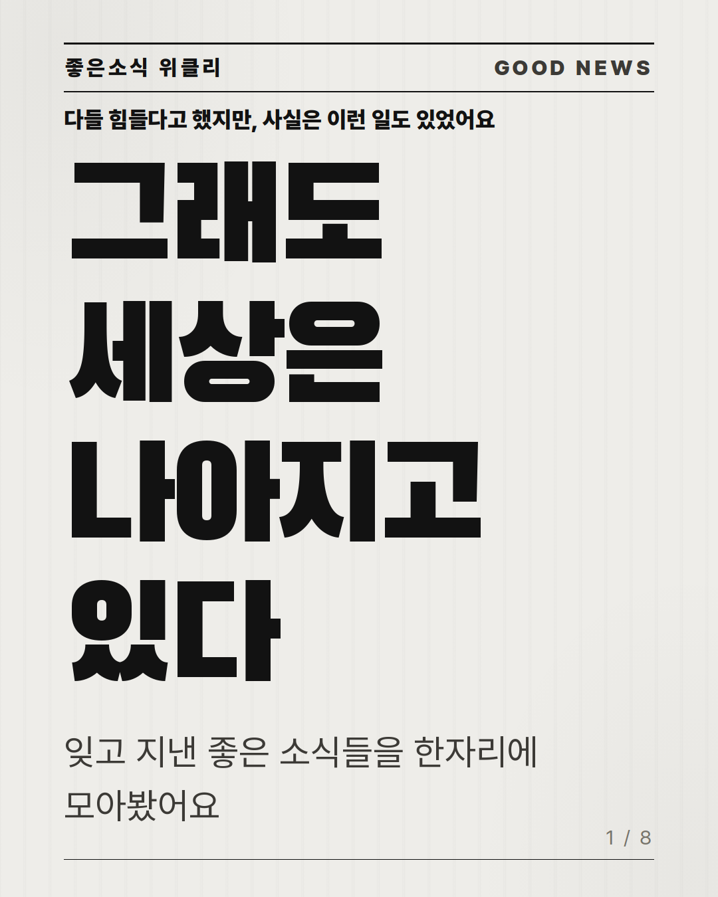
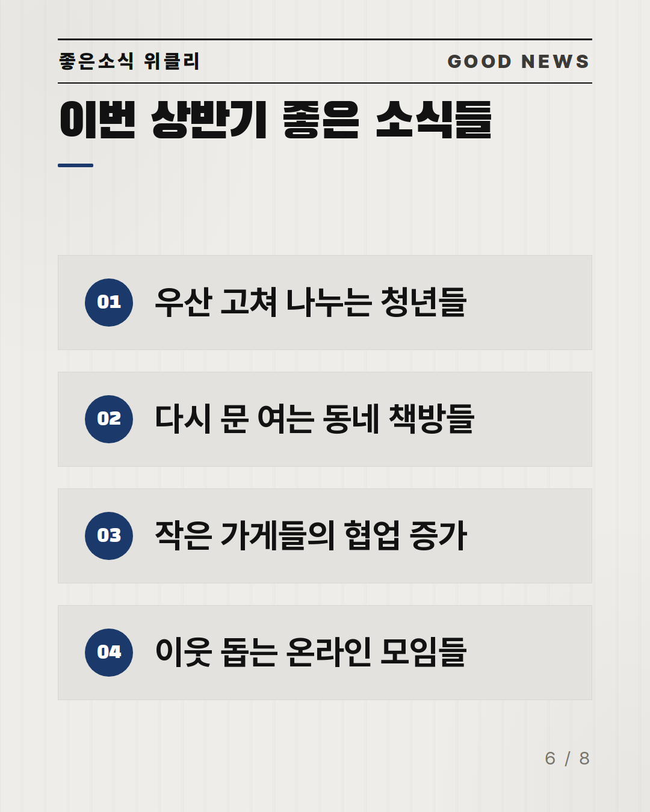

<div align="center">

<!-- HERO: replace with docs/hero.png (result banner) once R5 gallery is picked -->


# CardPrinter 🖨️

**Turn one topic line into a ready-to-post Instagram carousel *and* a 9:16 Reels video — fully automated, quality-gated, zero design skills required.**

**English** | [한국어](README.ko.md)

[](https://github.com/kimsh-1/cardprinter/stargazers)
[](LICENSE)
[](https://github.com/kimsh-1/cardprinter/releases)
[](#)

*An open-source alternative to Canva bulk-create, Predis.ai, and Ocoya — but the output is measured against physical quality gates, not vibes.*

</div>

---

## Demo

### Carousel (4:5)

|  |  |  |
|---|---|---|
| Photo article (`newsprint`) | Numbered roundup (`newsprint`) | Photo feature (`newsprint`) |

*Hero above: the `newsprint` cover system — modeled on a 300K-like Instagram carousel.*

### Reels (9:16)

https://github.com/kimsh-1/cardprinter/raw/main/docs/demo-reel.mp4

> Every carousel is derived from the same copy contract as its Reels cut, so the two never drift apart.
> (The clip above is a real pipeline output; GitHub renders `docs/demo-reel.mp4` inline.)

---

## ✨ Features

- **🗞️ One-line input** — give it a topic (or a news article); it writes the copy, lays out the cards, and renders both formats.
- **🎨 Tone tiers** — `luxury` · `character` · `brand` · `news` · `editorial` · `data`, plus custom tiers auto-built from a company's BI deck or a 5-question interview.
- **📐 Viral sequence templates** — checklist · listicle · data-infographic · photo-story · storytelling · versus, each a research-backed slide flow (triple-hook, mid save-trigger, end CTA).
- **🛡️ Physical quality gates** — contrast (WCAG pixel-measured), overflow (bbox ⊂ safe zone), fact-fidelity (no fabricated numbers), typography floor, layout diversity — all exit-code hard gates, not suggestions.
- **📊 Honest charts** — echarts SSR bar charts with a 0-based scale; the display string is the source of truth so numbers can't be exaggerated.
- **🎬 Card-news → Reels** — finished cards are composited into a 1080×1920 timeline with clean rise-in transitions (list/chart items reveal one by one — no zoom, no jitter), silent kinetic captions, per-card dwell derived from reading speed.
- **🏭 Mass production** — a headless `codex` factory runner produces topics in parallel with a self-heal loop (failed gates are fed back and regenerated).

---

## Why this instead of Canva / Predis.ai?

| | CardPrinter | SaaS bulk-create |
|---|---|---|
| Price | Free, open source | $ / month |
| Watermark | Never | On free tiers |
| Self-hosted | Yes | No |
| Quality enforcement | Physical exit-code gates | None (human eyeball) |
| Reels + carousel from one contract | Yes | Separate tools |
| Fact-fabrication guard | Hard gate | None |

---

## 🚀 Quick Start

```bash
# one topic → carousel + reels, all gates
bash scripts/pipeline.sh ./my-project draft
```

`my-project/` needs a `brief.json` + `copy.json` + `tokens.json` (or let the copy step generate them). See [How It Works](#-how-it-works).

---

## 🧠 How It Works

```
topic ─▶ brief ─▶ copy ─▶ tokens ─▶ [gates] ─▶ images ─▶ carousel HTML ─▶ PNG ─▶ [gates] ─▶ reels MP4 ─▶ [gates]
                    │        │                                                        │
              fact-checked  WCAG-safe                                          derived from cards
```

Each `[gates]` stage is an exit-code checkpoint. Nothing advances on a red gate — the factory runner regenerates until green or gives up honestly (it never ships a broken card as "done").

---

## 🏭 Mass Production (codex factory)

Turn a list of topics into a batch of gate-passed carousels, zero touch:

```bash
TOPICS=topics.jsonl OUTROOT=~/out PARALLEL=3 bash scripts/factory/run_factory.sh
```

```jsonl
{"id":"coffee-01","topic":"하루 커피 몇 잔이 적당할까","tier":"brand"}
{"id":"sleep-02","topic":"한국인 수면 실태 — 숫자로 보는 잠","tier":"data"}
```

Each topic drives `codex` to write the copy, runs the full render + gate pipeline, and **self-heals** — a
failing gate is fed back to `codex` and regenerated (up to 3 attempts). Only topics that pass every gate get
a `PASS` marker. **Full guide → [docs/FACTORY.md](docs/FACTORY.md).**

---

## 📥 Installation

### Requirements
- Node.js 20+
- Python 3.11+ venv (for pixel-level gates + `rembg` cutouts)
- `chrome-headless-shell` (bundled render path)

### Manual
```bash
git clone https://github.com/kimsh-1/cardprinter
cd cardprinter
# fonts, venv, chrome libs — see docs/INSTALL.md
```

---

## 📤 Output

| File | Spec |
|---|---|
| `out/card-NN.png` | 1080×1350 (4:5), one per slide |
| `out/short.mp4` | 1080×1920, 30fps, H.264/AAC, ~30–60s |
| `carousel/card-NN.html` | source card (also the Reels scene source) |

---

## 🗺️ Roadmap

- [x] 6 tone tiers + custom-tier ingest
- [x] 6 viral sequence templates
- [x] Physical gate suite + self-heal factory
- [ ] Newsprint / brush-highlight / book-page visual templates
- [ ] Hand-writing template
- [ ] TTS narration (optional, credential-gated)

---

## 🤝 Contributing

PRs welcome. Every rendering change must pass `node scripts/gates/run_gates.mjs all <project>` and add a gate if it introduces a new failure mode.

## Star History

[](https://star-history.com/#kimsh-1/cardprinter&Date)

## 📝 License

Code: MIT. Bundled fonts ship under their own OFL/Apache licenses — see [docs/FONT-LICENSES.md](docs/FONT-LICENSES.md).
